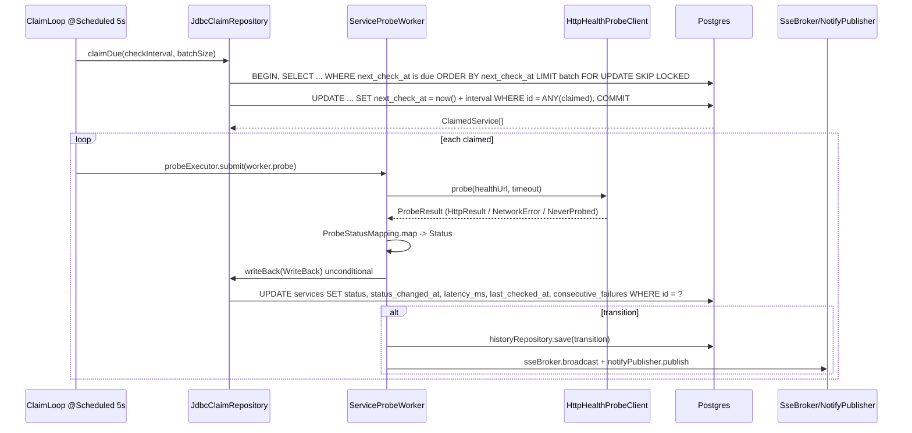
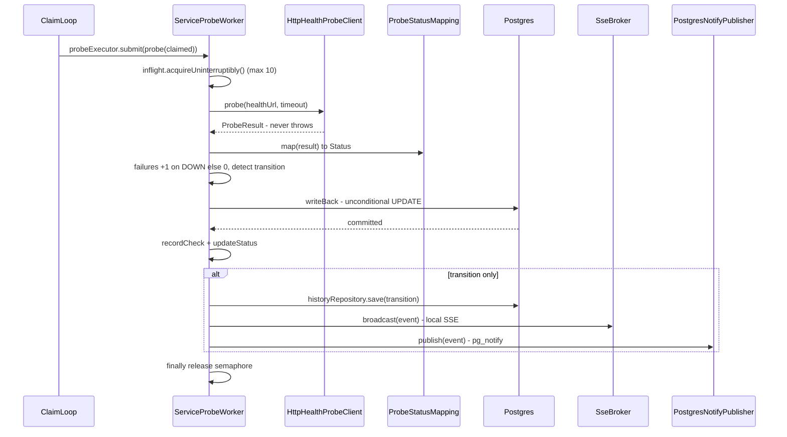
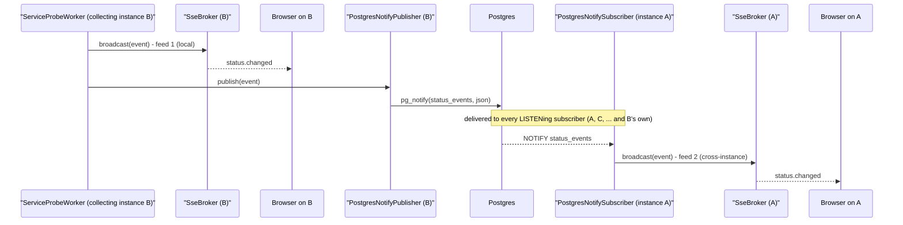

# status-api — Architecture & Navigation Guide

> Intended audience: a newcomer who must read, navigate, and eventually change this service.
> Sources of truth for *what it must do*: `docs/features/001-service-status-dashboard/adr.md` (ADR-001, §4.11 amendment), `api-contract.md` (frozen wire contract), `prd.md`, `plan.md`.
> This document is the *map* — real class names, real paths, no invented components. It describes the code as it exists on `feature/001-service-status-dashboard`; it does **not** change it.

---

## 1. What this service is

`status-api` is a **self-service, distributed service-health monitor with a live dashboard**. Monitored services register themselves (one API-key-authenticated `POST /api/v1/services` call per environment), and the service continuously probes their `healthUrl`, maps each probe to `up`/`degraded`/`down`/`unknown`, persists the current snapshot plus a transition history, and pushes status changes to browsers over Server-Sent Events. There is **no single leader**: multiple `status-api` instances coordinate through a single Postgres work-queue — `services.next_check_at` — claimed atomically with `FOR UPDATE SKIP LOCKED` (the **claim-and-advance** pattern, ADR §4.11), so any instance can die and the survivors pick up due rows on the next tick with no duplicate probing. It is Java 25 / Spring Boot 4, hexagonal in shape (ports/adapters), virtual-threaded throughout, and demoable with `docker compose up`.

---

## 2. Component map

All paths are under `src/main/java/dev/status/`. **Weight** marks whether a piece is load-bearing (earns its existence) or thin/ceremonial (exists mostly to satisfy a convention or the plan's task list).

### `domain/` — entities + value types

| Component | Single responsibility | Key collaborators | Weight |
|---|---|---|---|
| `ServiceEntity` | The `services` table row: registration metadata (`key`, `name`, `env`, `healthUrl`, `tags`) **and** the live status snapshot (`status`, `consecutiveFailures`, `nextCheckAt`, `latencyMs`, `lastCheckedAt`, `statusChangedAt`). `nextCheckAt` is the schedule trigger. | `ServiceRepository`/`JpaServiceRepository`, `ServiceStatus.from()`, `StatusConverter` | **Load-bearing** |
| `ApiKeyEntity` | The `api_keys` table row: a key bound to one `env`, with `revokedAt`. Read by the auth filter. | `ApiKeyRepository`/`JpaApiKeyRepository` (`findActiveByKey`), `ApiKeyAuthFilter` | Thin (its `create()`/`isRevoked()`/`save()` are dead — see §6) |
| `StatusHistoryEntity` | The `status_history` table row: one `from → to` transition + `changedAt` + `reason`. | `StatusHistoryRepository`/`JpaStatusHistoryRepository`, `ServiceProbeWorker` | Thin (append + read) |
| `Status` (enum) | `UP/DEGRADED/DOWN/UNKNOWN`, stored as lowercase wire values; `fromValue()` is case-insensitive and maps misses → `UNKNOWN`. | `StatusConverter`, `ProbeStatusMapping`, everywhere a status appears | Thin, load-bearing (the wire enum) |
| `StatusConverter` | JPA `AttributeConverter` persisting `Status` as its lowercase string. | `ServiceEntity`, `StatusHistoryEntity` | Thin |
| `ProbeResult` | **Sealed** interface over three outcomes: `HttpResult` (status/bodyStatus/latency), `NetworkError` (latency/reason), `NeverProbed`. Enables exhaustive switches with no `default`. | `HttpHealthProbeClient`, `ProbeStatusMapping`, `ServiceProbeWorker` | **Load-bearing** (closed-set modelling) |
| `WriteBack` | Value object carrying a probe outcome to the unconditional write-back. | `ServiceProbeWorker` → `ClaimRepository.writeBack` | Thin (param object) |
| `ClaimedService` | Value object for one row won by `claimDue` (re-reads the snapshot fields so the prober sees fresh state). | `JdbcClaimRepository` → `ServiceProbeWorker` | Thin |

### `port/` — outbound interfaces (the hexagonal "secondary ports")

| Component | Single responsibility | Adapter(s) | Weight |
|---|---|---|---|
| `ClaimRepository` | `claimDue(checkInterval, batchSize)` atomically claims due rows and advances their schedule (`FOR UPDATE SKIP LOCKED`); `writeBack(writeBack)` persists the result unconditionally. | `JdbcClaimRepository` (raw SQL) | **Load-bearing** — the whole distributed mechanism |
| `ServiceRepository` | CRUD + env-scoped queries for `services`. | `JpaServiceRepository` | Thin (one adapter, no double) |
| `ApiKeyRepository` | `findActiveByKey` (non-revoked) + `save`. | `JpaApiKeyRepository` | Thin (`save` is dead) |
| `StatusHistoryRepository` | `save` + `findByServiceId` (newest first). | `JpaStatusHistoryRepository` | Thin |
| `HealthProbeClient` | One `probe(url, timeout)` returning a `ProbeResult`; never throws. | `HttpHealthProbeClient` | **Load-bearing** (real outbound HTTP) |
| `NotifyPublisher` | `publish(StatusEvent)` to the Postgres `LISTEN/NOTIFY` bus. | `PostgresNotifyPublisher` | **Load-bearing** (cross-instance re-broadcast) |

### `adapter/` — the implementations

| Component | Single responsibility | Notes | Weight |
|---|---|---|---|
| `JdbcClaimRepository` | The claim-and-advance transaction: `SELECT … WHERE next_check_at <= now() ORDER BY next_check_at LIMIT batch FOR UPDATE SKIP LOCKED`, then `UPDATE … SET next_check_at = now() + interval WHERE id = ANY(claimed)`, all in one transaction; plus the unconditional write-back. **This is the core of the system.** | Raw `JdbcTemplate`; `@Transactional` | **Load-bearing** |
| `JpaServiceRepository` | Spring Data JPA for `services`. `search(...)`/`summarize(...)` push the list filtering (env/status/q/tag), `key` ordering, raw offset/limit pagination, and the summary counters into Postgres (native query: `strpos(lower(…))` for `q`, `jsonb_exists(tags, …)` for the JSONB tag predicate, and a conditional-aggregation `count(*) FILTER (…)` for the whole-filtered-set summary). | Derived + native queries | Thin |
| `JpaApiKeyRepository` | Spring Data JPA for `api_keys`; `findActiveByKey` filters `revokedAt is null` in JPQL. | | Thin |
| `JpaStatusHistoryRepository` | Spring Data JPA for `status_history`. | | Thin |
| `HttpHealthProbeClient` | `java.net.http.HttpClient` single GET, 2s connect timeout, tolerant regex parse of the `"status"` field; all failures → `NetworkError` (never throws). | `reasonFor()` switch → "timeout"/"connect timeout"/"connection error" | **Load-bearing** |
| `PostgresNotifyPublisher` | `SELECT pg_notify('status_events', <json>)` via `JdbcTemplate`. | | **Load-bearing** |
| `PostgresNotifySubscriber` | A virtual thread that `LISTEN status_events`, drains `PGNotification[]`, JSON-parses each payload into a `StatusEvent`, and forwards to `SseBroker`. Reconnects on drop. | `SseBroker` | **Load-bearing** |

### `application/` — use cases + the monitoring loop

| Component | Single responsibility | Key collaborators | Weight |
|---|---|---|---|
| `CatalogService` | Registration/read/update/delete/history use cases. Enforces **env scoping** (`body.env` must equal the key's env → 403) and duplicate-key `409`. The list/history methods are thin: they normalize the optional query params and delegate filtering, ordering, pagination and the `summary` counters to the repository query layer. | `ServiceRepository`, `StatusHistoryRepository`, `ApiException` | **Load-bearing** |
| `ClaimLoop` | `@Scheduled` (5s `fixedDelay`) dispatcher: calls `claimDue`, submits each claimed row to the probe executor. | `ClaimRepository`, `MonitoringMetrics`, `ServiceProbeWorker`, probe `ExecutorService` | **Load-bearing** |
| `ServiceProbeWorker` | Per-claim probe: map result → status, `writeBack` (unconditional), and on transition append history + broadcast SSE + `NOTIFY`. | `HealthProbeClient`, `ProbeStatusMapping`, `ClaimRepository`, `StatusHistoryRepository`, `SseBroker`, `NotifyPublisher`, `MonitoringMetrics` | **Load-bearing** (the orchestrator of a single check) |
| `ProbeStatusMapping` | `map(ProbeResult) → Status` as an exhaustive switch over the sealed `ProbeResult`. | | Thin but **load-bearing** (the mapping table, §contract §5) |
| `SseBroker` | Holds this instance's live `SseEmitter`s keyed by env; broadcasts a `StatusEvent` to the matching env's clients. | `SseController`, `PostgresNotifySubscriber`, `ServiceProbeWorker` | **Load-bearing** |
| `MonitoringMetrics` | Micrometer meters: `status_checks_total`, `status_check_duration_seconds`, `status_up` (MultiGauge), `status_transitions_total`, `status_claims_total`, `status_inflight_checks`. | `MeterRegistry` | Thin, **load-bearing** (observability contract) |

### `web/` — HTTP boundary

| Component | Single responsibility | Key collaborators | Weight |
|---|---|---|---|
| `ServiceController` | `@RestController` for `/api/v1/services`; thin bodies: bind/validate → call `CatalogService` → map to response DTO. | `CatalogService`, `ServiceResponseMapper` | Thin |
| `ServiceApi` | The **interface** carrying springdoc `@Operation`/`@Parameter`/`@ApiResponse` + Jakarta `@Pattern`/`@Min`/`@Max` parameter constraints (they must live here, not on the controller — Bean Validation §4.5.5). | `ServiceController` | Thin (see §6 for the "why") |
| `SseController` | `GET /api/v1/events` → registers an `SseEmitter` with `SseBroker`, sets `no-cache`/`keep-alive`. | `SseBroker` | Thin |
| `SseApi` | The springdoc-only interface for the SSE stream. | `SseController` | Thin |
| `ApiKeyAuthFilter` | `OncePerRequestFilter` enforcing `X-API-Key` on mutating `/api/v1/services` methods; missing/unknown → 401 (inline 4-field envelope); else stores the key's bound `env` as request attr `statusApi.authEnv`. | `ApiKeyRepository` | **Load-bearing** |
| `RequestIdFilter` | Assigns a `requestId` into MDC + `X-Request-Id` header. | (logging) | Thin, load-bearing (correlation) |
| `GlobalExceptionHandler` | `@RestControllerAdvice` mapping `ApiException` + validation/type-mismatch/404/500 to RFC 9457 `ProblemDetail` envelopes (exhaustive switch over sealed `ApiException`). | `ProblemDetail`, `ApiException`, `RequestIdFilter` | **Load-bearing** (the error contract) |
| `ApiException` | **Sealed** hierarchy of app errors: `BadRequest`/`Forbidden`/`NotFound`/`Conflict`/`Unprocessable`. Only `Forbidden`/`NotFound`/`Conflict` are ever thrown (§6). | `GlobalExceptionHandler`, `CatalogService` | Load-bearing (closed set); 2 of 5 subtypes are dead |
| `ProblemDetail` | RFC 9457 envelope record; `minimal()` (401/403) vs `full()` (instance+requestId); `errors[]` attached only when non-empty. | `GlobalExceptionHandler` | Thin, load-bearing |
| `ServiceResponseMapper` | MapStruct `@Mapper(componentModel="spring")`: `dto.*` → `web.*Response`. Mechanical identity copy (§6). | `ServiceController` | Thin (**ceremonial** — the two type layers are field-identical) |
| `ServiceListResponse` / `ServiceStatusResponse` / `StatusHistoryResponse` | Wire response records. | `ServiceResponseMapper` | Thin (duplicates of the `dto` records) |

### `dto/` — application-service result + request types

| Component | Single responsibility | Weight |
|---|---|---|
| `ServiceStatus` | Application-service return type; `ServiceStatus.from(ServiceEntity)` maps entity → DTO. | Thin (**field-identical to `web.ServiceStatusResponse`**) |
| `ServiceList` (+ `Summary`) | Matrix + counters result type. | Thin (duplicates `ServiceListResponse`) |
| `ServiceHistory` (+ item) | History result type. | Thin (duplicates `StatusHistoryResponse`) |
| `ServiceRegistration` | Request body with Jakarta validation constraints (`key` pattern, `healthUrl` http(s), sizes). | **Load-bearing** (the input contract) |
| `StatusEvent` (+ `ServiceRef`) | SSE payload `{event:"status.changed", service, from, to, at, latencyMs, reason}`; also the `NOTIFY` payload. | **Load-bearing** |

### `config/` — startup wiring

| Component | Single responsibility | Weight |
|---|---|---|
| `StatusApiApplication` | `@SpringBootApplication` + `@EnableScheduling` + `@EnableConfigurationProperties(MonitoringProperties)`. | Thin entry point |
| `MonitoringProperties` | `@ConfigurationProperties("monitoring")` record of tunables: `checkInterval` (15s), `timeout` (2s), `maxInFlight` (10), `batchSize` (50). | Thin |
| `MonitoringConfiguration` | Beans: `monitoringInflightSemaphore` (`Semaphore(maxInFlight)`), `monitoringProbeExecutor` (virtual-thread executor). | Thin (DI wiring) |
| `ApiKeySeeder` | `ApplicationRunner` seeding `api_keys` from `app.seed-api-keys` (`key:env:name`, comma-separated), idempotent `ON CONFLICT DO NOTHING`. | Thin, load-bearing (dev/demo bootstrap) |

---

## 3. The runtime flows

Each flow is an ordered step list through the real classes. Method names are exact.

### 3.1 Registration — `POST /api/v1/services`

1. `RequestIdFilter` (web) — assigns `requestId` to MDC and echoes `X-Request-Id` (all requests).
2. `ApiKeyAuthFilter.doFilterInternal` — only for `POST/PUT/DELETE` under `/api/v1/services`: reads `X-API-Key`; missing/blank/unknown → **401** (`{"type":"about:blank","title":"Unauthorized","status":401,"detail":"Invalid or missing API key"}`); else `apiKeyRepository.findActiveByKey(key)` and stores the key's `env` as request attribute `statusApi.authEnv`.
3. `ServiceController.register` — `@Valid @RequestBody ServiceRegistration` (bean validation on the DTO) + `@RequestAttribute(ApiKeyAuthFilter.AUTH_ENV_ATTR) keyEnv`; calls `service.register(body, keyEnv)`.
4. `CatalogService.register` — `enforceEnvMatch(body.env(), keyEnv)` (mismatch → `ApiException.forbidden` → **403**); `serviceRepository.existsByKeyAndEnv(key, env)` (duplicate → `ApiException.conflict` → **409**); construct the `ServiceEntity` from the `ServiceRegistration` body (a new service starts `status=UNKNOWN`, `nextCheckAt=now()`, `consecutiveFailures=0`); `serviceRepository.save(entity)`.
5. `JpaServiceRepository` → Spring Data JPA → Postgres `services` row (Flyway schema `V1__baseline.sql`).
6. Return path: `ServiceStatus.from(entity)` (`dto`) → `ServiceController` → `mapper.toResponse(...)` (`ServiceResponseMapper`, MapStruct → `web.ServiceStatusResponse`) → `ResponseEntity.status(201)`.
7. Any thrown `ApiException` / validation failure / unknown route → `GlobalExceptionHandler` → `ProblemDetail` envelope.

> Note: the `env` in the body **must match** the key's bound env; the key is **only** for writes — reads are unauthenticated (internal network).

### 3.2 Claim → probe → transition (the steady-state loop)



1. `ClaimLoop.claimAndProbe()` fires every 5s (`fixedDelayString="${monitoring.claim-tick-ms:5000}"`).
2. `claimRepository.claimDue(props.checkInterval(), props.batchSize())` → `JdbcClaimRepository` runs one transaction: `SELECT id, key, name, env, health_url, status, consecutive_failures, status_changed_at … WHERE next_check_at <= now() ORDER BY next_check_at LIMIT ? FOR UPDATE SKIP LOCKED`, then `UPDATE services SET next_check_at = now() + make_interval(secs => ?) WHERE id = ANY(?)`. `SKIP LOCKED` guarantees exactly one winner per due row, and the schedule is advanced **at claim time**.
3. Each returned `ClaimedService` is submitted to the virtual-thread `probeExecutor` → `ServiceProbeWorker.probe(service)`.
4. `probe` acquires the bounded in-flight semaphore (`maxInFlight`, default 10), then `probeClient.probe(service.healthUrl(), props.timeout())` → `HttpHealthProbeClient`: single GET, 2s timeout, tolerant `"status"`-field parse; **never throws** — a failure becomes `ProbeResult.NetworkError`.
5. `ProbeStatusMapping.map(result)` — exhaustive switch over sealed `ProbeResult`: `NeverProbed`→`UNKNOWN`, `NetworkError`→`DOWN`, `2xx+"degraded"`→`DEGRADED`, `2xx` (other/missing)→`UP`, non-2xx→`DOWN`.
6. `failures = (newStatus==DOWN) ? consecutiveFailures+1 : 0`; `transition = newStatus != oldStatus`; `statusChangedAt` advances only on transition.
7. Build `WriteBack(serviceId, newStatus, statusChangedAt, latency, failures)` and `claimRepository.writeBack(writeBack)`.
8. `JdbcClaimRepository.writeBack` runs the **unconditional** `UPDATE services SET status=?, status_changed_at=?, latency_ms=?, last_checked_at=now(), consecutive_failures=? WHERE id=?` — no ownership re-check (the schedule was already advanced at claim time).
9. `metrics.recordCheck(...)` + `metrics.updateStatus(...)`.
10. On **transition**: `historyRepository.save(StatusHistoryEntity.transition(...))`; build `StatusEvent.changed(...)`; `log.info "status changed …"`; `metrics.recordTransition(...)`; `sseBroker.broadcast(event)` (local clients); `notifyPublisher.publish(event)` (`PostgresNotifyPublisher` → `pg_notify('status_events', json)`).
11. `finally` releases the semaphore. **up-stays-up / down-stays-down are silent** (transition-only logging).

### 3.3 SSE fan-out — `GET /api/v1/events?env=…`

1. Browser (`static/index.html` + `static/app.js`) opens `new EventSource('/api/v1/events?env=…')`.
2. `SseController.events(env)` → `sseBroker.register(env, new SseEmitter(0L))` with `Cache-Control: no-cache`, `Connection: keep-alive`, `text/event-stream`.
3. `SseBroker` keeps a `ConcurrentHashMap<String, Set<SseEmitter>>` keyed by env; completion/timeout/error callbacks remove the emitter.
4. Independently, `PostgresNotifySubscriber` (a `Thread.ofVirtual()` started in `@PostConstruct`) runs `LISTEN status_events` on a dedicated connection and drains `PGNotification[]`; each payload is JSON-parsed to `StatusEvent` and forwarded to `sseBroker.broadcast(event)`.
5. `SseBroker.broadcast` sends `SseEmitter.event().name("status.changed").data(event)` to every emitter of the matching env — **regardless of which instance collected the transition** (that is the whole point of the `NOTIFY` re-broadcast).
6. `app.js` on `status.changed`: flips the card's class + badge, then re-fetches `GET /api/v1/services?env=…` to reconcile counters (idempotent).

### 3.4 Startup wiring (easy to miss)

1. `StatusApiApplication` — `@SpringBootApplication`, `@EnableScheduling`, `@EnableConfigurationProperties(MonitoringProperties.class)`.
2. Flyway runs `V1__baseline.sql` → creates `api_keys`, `services`, `status_history` (+ index); then `V2__drop_claim_and_instance.sql` drops the superseded `service_claim` and `instance` tables (claim-and-advance needs neither).
3. `MonitoringConfiguration` provides the two loop collaborators as beans: `monitoringInflightSemaphore`, `monitoringProbeExecutor` (virtual threads).
4. `MonitoringProperties` binds `monitoring.*` from `application.yml` (check interval 15s, timeout 2s, in-flight 10, batch size 50). The claim loop's tick is read as a raw string key `monitoring.claim-tick-ms`.
5. `ApiKeySeeder` (`ApplicationRunner`) seeds `api_keys` from `app.seed-api-keys` (`"key:env:name"`, comma-separated) — idempotent.
6. `PostgresNotifySubscriber` (`@PostConstruct`) opens the `LISTEN` thread.
7. `ClaimLoop` (`@Scheduled` 5s) begins the steady-state loop of §3.2.

### 3.5 Failover / rebalance (easy to miss)

1. An instance dies — including mid-probe, after claiming but before writing back.
2. Crucially, `services.next_check_at` **survives** — it's a column on the `services` row and was already advanced atomically at claim time — so the dead instance's in-flight check is simply **lost** (a one-interval gap), never re-claimed and never duplicated.
3. A survivor's `ClaimLoop.claimDue` matches `WHERE next_check_at <= now()` on the next tick and probes the service **on the persisted schedule**. Rebalance is **immediate** — there is no TTL to wait out.
4. **`consecutiveFailures` and `status` survive** — they're columns re-read into `ClaimedService` at claim time, so a failing service keeps its state across an owner's death.

---

## 4. Start here — a read order

Read in this sequence for the fastest mental model. Each "why" tells you what the file unlocks next.

1. `docs/features/001-service-status-dashboard/adr.md` — the *why*: decisions behind registration, env scoping, claim-and-advance scheduling (§4.11), SSE. Everything else is this, compiled. *(This file lives in the hub repo, not here.)*
2. `docs/features/001-service-status-dashboard/api-contract.md` — the frozen wire contract (schemas, status codes, error envelopes) every class must satisfy.
3. `src/main/resources/db/migration/V1__baseline.sql` + `V2__drop_claim_and_instance.sql` — the schema; `next_check_at` is the whole distributed story.
4. `src/main/java/dev/status/domain/ServiceEntity.java` — the row that is simultaneously registration metadata *and* the live status snapshot + schedule trigger.
5. `src/main/java/dev/status/port/ClaimRepository.java` → `adapter/JdbcClaimRepository.java` — the claim-and-advance SQL + unconditional write-back; the core mechanism, worth reading the SQL closely.
6. `src/main/java/dev/status/application/ClaimLoop.java` → `application/ServiceProbeWorker.java` — the dispatcher and the per-check orchestrator; ties probe → map → write-back → history → broadcast together.
7. `src/main/java/dev/status/domain/ProbeResult.java` → `application/ProbeStatusMapping.java` — the sealed result set and the exhaustive mapping (the contract's §5 table).
8. `src/main/java/dev/status/web/ServiceController.java` → `application/CatalogService.java` — the read/write HTTP surface and the env-scoping business rules.
9. `src/main/java/dev/status/web/ApiKeyAuthFilter.java` → `web/GlobalExceptionHandler.java` → `web/ProblemDetail.java` — auth + the RFC 9457 error envelopes.
10. `src/main/java/dev/status/application/SseBroker.java` → `adapter/PostgresNotifySubscriber.java` → `web/SseController.java` — the SSE fan-out and cross-instance re-broadcast.
11. `src/main/java/dev/status/config/MonitoringProperties.java` + `config/MonitoringConfiguration.java` — the tunables and DI wiring.
12. `src/test/java/dev/status/TraceabilityMatrixTest.java` — the FR/AC → test-name index; the fastest way to find the test that proves any given behaviour.

---

## 5. Test map

The suite is **65 test methods** across **22 concrete test classes** (Gradle reports 22 result classes — `ProbeStatusMappingTest`'s `@Nested` `Mapping` container is emitted separately in place of its empty parent, so the result-class count coincides with the concrete-class count). Three abstract base classes (`BaseApiTest`, `MonitoringApiTest`, `RealServerMonitoringApiTest`) and four helpers (`PostgresHolder`, `AppInstance`, `TestKeys`, `test/FakeService`) provide the harness. All API tests run against **real Testcontainers Postgres** — no H2, no in-process mocks.

| Group | Classes | What each proves | Single test to run for the area |
|---|---|---|---|
| **Unit (pure)** | `application/ProbeStatusMappingTest` | The probe→status mapping table (all 9 rows incl. tolerant-up + never-probed). | `ProbeStatusMappingTest` (mapping) |
| **Claim SQL (unit+DB)** | `ClaimLoopSqlTest` | The claim-and-advance transaction yields **disjoint** claim sets under concurrency; `next_check_at` is advanced **at claim time**; a claimed-but-not-written-back row is not re-claimed. | `ClaimLoopSqlTest` — validate the distributed mechanism |
| **API-first (MockMvc)** | `WalkingSkeletonApiTest`, `ServiceRegistrationApiTest`, `ServiceReadApiTest`, `ServiceUpdateDeleteApiTest`, `ServiceHistoryApiTest`, `ContractGoldenTest`, `OpenApiDocsApiTest` | Boot + health + empty list; full POST/GET/PUT/DELETE happy + error code matrix with exact RFC 9457 envelopes; env scoping, filters, raw offset/limit pagination (exact offset skip); wire JSON schemas; springdoc `/v3/api-docs` still documents every op. | `ContractGoldenTest` — validate the wire contract is intact |
| **Fault injection (API-first)** | `MonitoringFaultInjectionApiTest`, `DashboardDataApiTest`, `DashboardReconcileTest`, `BackpressureApiTest` | Flip a `FakeService` down/up → transition + history + `consecutiveFailures` increment/reset; one `GET /services` returns matrix **and** counters; snapshot re-fetch reconciles a missed transition; more due services than the in-flight cap → concurrency never exceeds `max-in-flight` (bounded in-flight). | `MonitoringFaultInjectionApiTest` — validate transition detection |
| **SSE delivery** | `SseDeliveryApiTest`, `CrossInstanceNotifyTest` | A connected client sees a `status.changed` within one interval; a transition collected by instance A is delivered to a dashboard on instance B via `LISTEN/NOTIFY`. | `CrossInstanceNotifyTest` — validate the re-broadcast |
| **Multi-instance** | `MultiInstanceRebalanceTest` | Recycle the owner → survivors continue on schedule, no duplicate probing, `consecutiveFailures`/status preserved, rebalance immediate. | `MultiInstanceRebalanceTest` — validate failover/rebalance |
| **Observability** | `MetricsObservabilityTest`, `StructuredLoggingTest` | Prometheus exposes the metric set; transitions are logged and `up→up` is silent. | `StructuredLoggingTest` — validate transition-only logging |
| **E2E / topology** | `EndToEndApiTest`, `MockServiceFaultInjectionTest`, `ComposeSmokeTest` | Real HTTP end-to-end: register → probe → SSE transition → persisted state/history, all asserted via the API; `POST /__fault` turns a cell red within one interval; `docker-compose.yml` declares the full topology + env vars. | `EndToEndApiTest` — the full-loop smoke test |
| **Traceability** | `TraceabilityMatrixTest` | Every FR1–FR11 / AC1–AC15 / S50 row names a real, resolvable test method (build fails on an empty/missing row). | `TraceabilityMatrixTest` — validate coverage wiring |

**Fastest single gate:** `./gradlew test` (pinned to Java 25 — see `repo-status-api` skill). To validate one area, run the specific class, e.g. `./gradlew test --tests '*MultiInstanceRebalanceTest'`.

---

## 6. Where the moving parts are

An honest split between indirection that pays for itself and decomposition that exists mainly because the plan enumerated it.

### Load-bearing indirection — keep

- **The claim-and-advance model (`JdbcClaimRepository`)**. The single `FOR UPDATE SKIP LOCKED` transaction is the entire distributed no-leader mechanism: it expresses "each due row is claimed by exactly one instance per slot, and its schedule advances at claim time" with two SQL statements. This is the one place the complexity is irreducible.
- **The sealed result/exception sets (`ProbeResult`, `ApiException`)**. Sealing forces exhaustive switches with no `default`, so adding a probe outcome or error variant is a compile error until every consumer handles it. That is real correctness leverage, not ceremony.
- **The port boundaries that map to a *different technology or a real seam***: `ClaimRepository` (raw JDBC vs JPA), `HealthProbeClient` (real outbound HTTP), `NotifyPublisher`/`PostgresNotifySubscriber` (Postgres `LISTEN/NOTIFY`). These are where you'd swap an implementation or fake a dependency.
- **`RequestIdFilter` → MDC → `ProblemDetail.requestId`** — request correlation is part of the frozen error contract and the logging story.
- **Env scoping in `CatalogService`** — row-level `env` isolation is a PRD guarantee, and it lives in exactly one place (the application service), which is correct.

### Incidental / ceremonial decomposition — the "so many moving parts"

These are the pieces that make the codebase feel larger than it is. Most are **dead code or duplicate layers**, not wrong code:

1. **The `dto` ↔ `web` double type layer.** `ServiceStatus` ≡ `ServiceStatusResponse`, `ServiceList` ≡ `ServiceListResponse`, `ServiceHistory` ≡ `StatusHistoryResponse` are field-for-field identical; `ServiceResponseMapper` (MapStruct) is a mechanical identity copy between them. The wire shape is pinned by `ContractGoldenTest`, but there are **two identical representations of every response** plus a mapper, purely so entities→`dto`→`web` is a "clean" triple boundary.
2. **Dead port methods.** `ApiKeyRepository.save` (+ `ApiKeyEntity.create`/`isRevoked`) and `ServiceRepository.findByKeyAndEnv` are declared but **never called**.
3. **Two never-thrown error subtypes.** `ApiException.BadRequest` and `ApiException.Unprocessable` (and their factories) are never instantiated — they exist only so the switch over the sealed `ApiException` stays exhaustive. 400s actually flow through the validation handlers, and the contract's **422** ("self-referential healthUrl") was never implemented.
4. **The one-impl ports.** `ServiceRepository`, `ApiKeyRepository`, `StatusHistoryRepository` each have exactly one adapter and no test double (tests use real Postgres). They exist to honor the hexagonal convention, but only `ClaimRepository`/`HealthProbeClient`/`NotifyPublisher` are seams you'd actually swap.
5. **The `*Api` interface split.** `ServiceApi`/`SseApi` carry the springdoc + validation annotations while the controller carries MVC mappings — a real constraint (Bean Validation §4.5.5 forbids redefining parameter constraints on the implementation), pinned by `OpenApiDocsApiTest`. It *is* justified, but it reads as "two files per endpoint" until you know why.

---

## 7. Deep dive: the monitoring and streaming core

Two components carry the entire steady-state runtime: `ServiceProbeWorker` turns one claimed row into one persisted result (and, on a change, a transition), and `SseBroker` turns any transition into a live browser update. Read them together and "how does this actually work" collapses to a dozen lines.

### 7.1 `ServiceProbeWorker` — the per-check orchestrator

`ClaimLoop.claimAndProbe()` submits each `ClaimedService` to the virtual-thread `probeExecutor`; each submitted task is **one** `ServiceProbeWorker.probe(ClaimedService service)`. That one method is the whole per-check pipeline:

1. **Acquire the bounded in-flight semaphore** — `inflight.acquireUninterruptibly()`, then `metrics.setInflight(inflightCount())`. The semaphore (`monitoringInflightSemaphore`, default `maxInFlight = 10`) is the **one retained** backpressure guard: it caps concurrent probes so a slow `healthUrl` can't pile up virtual threads/sockets, and it does **not** multiply the check rate.
2. **Probe** — `probeClient.probe(service.healthUrl(), props.timeout())`. `HttpHealthProbeClient` issues a single `GET` with a 2s connect timeout and the `props.timeout()` (default 2s) request timeout, tolerantly regex-parses the `"status"` field, and **never throws**: every failure becomes `ProbeResult.NetworkError` with a reason (`"timeout"` / `"connect timeout"` / `"connection error"` / class simple name).
3. **Map** — `mapping.map(result)` (`ProbeStatusMapping`) is an exhaustive switch over the sealed `ProbeResult` with no `default`: `null` and `NeverProbed` → `UNKNOWN`; `NetworkError` → `DOWN`; `HttpResult` 2xx + `"degraded"` body status → `DEGRADED`; `HttpResult` 2xx (ok/missing/other) → `UP` (tolerant-up); non-2xx → `DOWN`.
4. **Failure accounting** — `failures = (newStatus == Status.DOWN) ? service.consecutiveFailures() + 1 : 0`. Increment on `DOWN`, reset to `0` on any other result. (`service.consecutiveFailures()` was re-read into `ClaimedService` at claim time.)
5. **Transition detection** — `transition = newStatus != service.status()`; `statusChangedAt = transition ? Instant.now() : service.statusChangedAt()`. The timestamp advances **only** on an actual change; `service.status()` / `statusChangedAt()` are the snapshot columns carried in `ClaimedService`.
6. **Build the write-back** — `WriteBack(serviceId, newStatus, statusChangedAt, latency, failures)`, where `latency = (int) min(result.latencyMs(), Integer.MAX_VALUE)` and `reason = reasonFor(result)` (`NetworkError` → its reason; non-2xx `HttpResult` → `"HTTP <code>"`; otherwise `null`).
7. **Unconditional write-back** — `claimRepository.writeBack(writeBack)` runs the plain `UPDATE services SET status=?, status_changed_at=?, latency_ms=?, last_checked_at=now(), consecutive_failures=? WHERE id=?`. **There is no ownership re-check — and none is needed:** `next_check_at` was already advanced in the claim transaction, so there is no lease/owner to verify and no "claim lost" branch. Note `next_check_at` is **not** touched here.
8. **Metrics** — `metrics.recordCheck(key, newStatus, latencyMs)` (counter `status_checks_total{service,result}` + timer `status_check_duration_seconds`) and `metrics.updateStatus(key, newStatus)` (the `status_up` MultiGauge).
9. **On transition only** — `historyRepository.save(StatusHistoryEntity.transition(serviceId, from, to, reason))` appends a `status_history` row; build `StatusEvent.changed(...)`; `log.info("status changed …")`; `metrics.recordTransition(from, to)` (`status_transitions_total{from,to}`); `sseBroker.broadcast(event)` (local SSE clients); `notifyPublisher.publish(event)` (`PostgresNotifyPublisher` → `pg_notify('status_events', json)`).
10. **Cleanup** — `finally` releases the semaphore and re-sets the inflight gauge; a catch-all `Exception` logs `"unexpected collector error"`. `up`-stays-`up` / `down`-stays-`down` are intentionally **silent** (transition-only logging).

**What the worker no longer does** — this is the whole point of the claim-and-advance redesign (ADR §4.11):

- **No next-check-time computation.** The schedule is a fixed interval, advanced inside the claim transaction (`next_check_at = now() + interval`), not `now() + interval × backoff × jitter`. The worker never computes when the next check happens.
- **No backoff, no jitter.** `consecutiveFailures` still increments/resets, but it is now just a persisted column, not an input to scheduling.
- **No claim-lost / ownership re-check branch.** `writeBack` is unconditional; the lease-era "did I still own this row?" `false`-return path is gone.
- **No lease renewal.** There is no lease.

Why this is safe: at-most-once is guaranteed the instant `JdbcClaimRepository.claimDue` advances `next_check_at`. From then on the worker's only job is "probe → map → persist → fan out"; a crash mid-flight can only lose that one check (a one-interval gap), never duplicate it.



### 7.2 `SseBroker` — the per-instance emitter registry and its two feeds

`SseBroker` holds this instance's live SSE connections in a single field:

```java
Map<String, Set<SseEmitter>> emittersByEnv = new ConcurrentHashMap<>();
```

- **`register(env, emitter)`** — `computeIfAbsent(env, k -> ConcurrentHashMap.newKeySet()).add(emitter)`, then wires `onCompletion` / `onTimeout` / `onError` to `remove(env, emitter)`. `SseController.events` calls it with `new SseEmitter(0L)` and answers `Cache-Control: no-cache`, `Connection: keep-alive`, `text/event-stream`.
- **`remove(env, emitter)`** — a plain set-removal; called on completion, timeout, error, **and** on a failed send in `broadcast`.
- **`broadcast(event)`** — env filtering: look up `emittersByEnv.get(event.service().env())`, return if empty, else `emitter.send(SseEmitter.event().name("status.changed").data(event))` to each; a send failure logs and removes that emitter.

The part that matters is the **two feeds** into `broadcast`:

1. **Local feed — `ServiceProbeWorker`.** When *this* instance collects a transition, its worker calls `sseBroker.broadcast(event)` directly (step 9 above). This covers clients connected to the instance that did the probing.
2. **Cross-instance feed — `PostgresNotifySubscriber`.** A `Thread.ofVirtual().name("pg-notify-listener")` (started in `@PostConstruct`) holds a dedicated connection with `LISTEN status_events`, drains `PGNotification[]` in a loop (`getNotifications(1000)`), JSON-parses each payload into a `StatusEvent`, and forwards it to `sseBroker.broadcast(event)`. On a dropped connection it reconnects after a 1s delay.

**Why the dual feed exists.** Work is spread across instances by `FOR UPDATE SKIP LOCKED`, so a given service's transitions can land on *any* instance. Without the cross-instance feed, a browser connected to instance A would only see the transitions A itself collected. Every instance's worker publishes each transition with `pg_notify('status_events', …)`; Postgres delivers that notification to **every** `LISTEN`ing subscriber; each subscriber re-broadcasts to its **own** local clients. So a browser on any instance sees every transition — local ones via feed 1, remote ones via feed 2.

**Delivery nuance (accurate, not a bug).** `NOTIFY` fans out to every listening session with **no origin filter** — the publishing instance's *own* subscriber is a separate connection, so it also receives its own `pg_notify` and re-broadcasts to the same clients the worker already reached. A client on the collecting instance therefore sees that transition **twice** (once from feed 1, once from the NOTIFY echo); clients on other instances see it once. This is harmless because the dashboard handler (`app.js` `status.changed`) is idempotent — it re-applies the same card class and re-fetches the snapshot. Effective SSE delivery is **at-least-once**, and the tests (`SseDeliveryApiTest`, `CrossInstanceNotifyTest`) assert containment, not exact frame count.



---

## 8. Consolidation opportunities

Bounded, behaviour-preserving candidates for the next phase. **Hard constraints honored throughout:** no wire-contract change (`ContractGoldenTest` stays green), no status-code/semantic change, no loss of PRD guarantees (failover/rebalance, backpressure, env scoping, API-first coverage, traceability). Ranked by **benefit ÷ risk**.

> **Already done (claim-and-advance amendment):** the lease/claim pair, lease TTL, lease renewal, write-back ownership re-check, the `service_claim` and `instance` tables, `BackoffCalculator`, the jitter source, `InstanceHeartbeat`, `InstanceIdentity`, `InstanceRepository`/`JdbcInstanceRepository`, `InstanceEntity`/`ServiceClaimEntity`, and the now-dead `MonitoringProperties` fields (`leaseTtl`, `backoffMs`, `jitter`, `claimCap`, `claimTick`, `heartbeatInterval`, `heartbeatTtl`) are all **removed**. `MonitoringProperties` now holds only the four surviving tunables.

| # | What | Why it reduces moving parts | Risk | Existing tests that cover it | Do first? |
|---|---|---|---|---|---|
| 1 | **Collapse the `dto` ↔ `web` response records into one set** (`ServiceStatus`+`ServiceList`+`ServiceHistory`), keep the `ServiceStatus.from(ServiceEntity)` entity-mapping, and **delete `ServiceResponseMapper`** (MapStruct identity copy) + the three `web/*Response` records. Controllers then return the single `dto` type. | Eliminates 3 duplicate records + 1 mapper + the whole "application-service type vs wire type" distinction. | **Med** — wide refactor touching controller/service/mapper; but wire JSON is unchanged (`ContractGoldenTest` stays green) and tests assert JSON, not Java types, so **no test rewrite**. Tension: `repo-status-api` non-negotiable says "MapStruct for all mappers" — removing the *identity* mapper is consistent with the spirit (mapping still happens, in `ServiceStatus.from`), but should be called out to the team. | `ContractGoldenTest` (wire), `OpenApiDocsApiTest` (docs), all `*ApiTest` (JSON assertions). | Second wave |
| 2 | **Delete dead port methods**: `ApiKeyRepository.save` (+ `ApiKeyEntity.create`/`isRevoked`) and `ServiceRepository.findByKeyAndEnv`. | Removes ~3 unused declarations. | **Low** — never called, no test references them. | No test touches `save`/`findByKeyAndEnv`. | ✅ Yes |
| 3 | **Remove the never-thrown `ApiException.BadRequest` / `ApiException.Unprocessable` subtypes + their factories**; keep `Forbidden`/`NotFound`/`Conflict`. | Shrinks the sealed set to the three errors actually thrown; the exhaustive switch stays exhaustive and honest. | **Low** — nothing emits them today, no status-code change. Note: the contract's **422** remains *documented-but-unimplemented*; removing `Unprocessable` makes that gap explicit — either implement the self-referential-`healthUrl` check later or get the contract (frozen) clarified. | `ContractGoldenTest` pins 401/403 only; no test asserts 422 or the `BadRequest` subtype. `GlobalExceptionHandler` switch recompiles (still exhaustive). | ✅ Yes |
| 4 | **Downsize the one-impl port set** — fold `ServiceRepository`/`ApiKeyRepository`/`StatusHistoryRepository` into their single adapters, keeping only `ClaimRepository`, `HealthProbeClient`, `NotifyPublisher` as true seams. | Removes 3 interfaces that only exist to satisfy the hexagonal convention. | **Med** — contradicts the repo's `hexagonal-architecture` convention; behaviour unchanged. `ClaimRepository` **must** stay (`ClaimLoopSqlTest` autowires it). Recommend "acknowledge, don't force". | `ClaimLoopSqlTest` (keeps `ClaimRepository`); other ports have no direct test references. | Optional |

**Suggested sequencing:** item 2 (dead-code removal, low-risk) first; then 1/3 (structural simplification, medium risk, no test rewrite); item 4 only with explicit team sign-off because it touches a stated convention.

---

## 9. Glossary

- **`env`** — a required dimension (`dev`, `prod`, …). Every service, API key, and history row is scoped to one `env`; an API key is bound to exactly one `env`, and a write whose body `env` doesn't match the key's `env` is `403`. Isolation is **row-level**, not schema-level.
- **`key`** — a stable human-readable slug (e.g. `payments`), unique *within an env* (`^[a-z0-9][a-z0-9-]{1,63}$`). Not to be confused with the **API key** (`X-API-Key`) that authenticates writes.
- **claim-and-advance / `next_check_at`** — the distributed scheduling model (ADR §4.11). `next_check_at` (on the `services` row) is the *single* coordination primitive: registration seeds it to `now()`, and each claim tick atomically selects due rows with `FOR UPDATE SKIP LOCKED` and advances them by the fixed interval. Because the schedule advances **at claim time**, a duplicate probe is impossible and a pod dying mid-probe loses only that one check (a one-interval gap).
- **transition vs snapshot** — a *snapshot* is the current state on the `services` row (`status`, `latencyMs`, `lastCheckedAt`, `consecutiveFailures`, `statusChangedAt`). A *transition* is a *change* of status, appended to `status_history` and broadcast via SSE + `NOTIFY`. Only transitions are logged and pushed.
- **`degraded` vs `down` vs `unknown`** — `degraded` is set **only** when the service itself returns `2xx` + `"status":"degraded"` (no latency inference in v1). `down` means non-2xx, timeout, or connection error. `unknown` means never probed (or a null/missing result).
- **bounded in-flight** — the one retained backpressure guard: a semaphore (default 10) caps concurrent probes per instance so a slow `healthUrl` can't pile up virtual threads/sockets. It does **not** multiply the check rate — the fixed interval is not scaled by pod count.
- **LISTEN/NOTIFY / SSE** — Postgres `LISTEN/NOTIFY` (channel `status_events`) is the cross-instance re-broadcast bus: every instance publishes each transition, every instance subscribes and forwards to its *own* Server-Sent Events clients, so a dashboard connected to any instance sees every transition.
